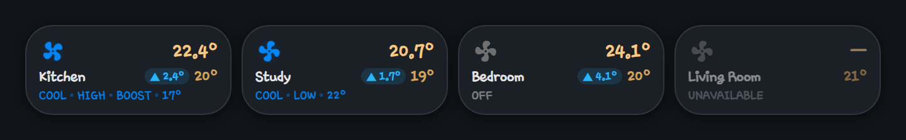
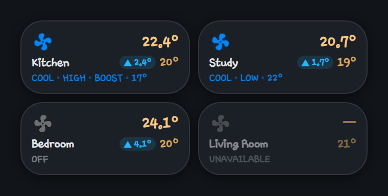
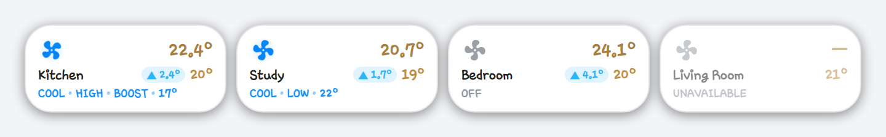

# HA AC Control

A compact custom [Home Assistant](https://www.home-assistant.io/) Lovelace card for
air-conditioning and heat-pump `climate` entities. Several rooms share one rounded
card — each row shows a fan that spins with the unit, the room temperature, its
target, how far apart they are, the current HVAC mode, and four touch-sized controls.


Everything is picked from dropdowns in a GUI editor, so no hand-written YAML is
required. One file, no build step, no external dependencies.

Tapping a room anywhere that is not one of its buttons turns that unit on or off.
The controls sit two-by-two beside the text — minus and plus above, power and AUTO
below — which leaves each button roughly twice the area of a single row of four,
and hands the width it saves back to the temperatures.

The same card at phone widths — the four controls drop to one line of their own,
and boost stays under the fan:

| 380px | 300px |
|---|---|
|  |  |

Or `layout: compact` for a small tile per room, sized to sit several across a
dashboard. Tap one to turn that unit on or off:



On a phone, two per row:



The same tiles on a light theme:



## Features

- **One card, many rooms.** Rooms are separated by a thin divider; the card height
  follows the number of rooms. Stacked, the card tightens up: the first row sits
  against the top edge and the last against the bottom, and the difference badge
  moves onto the status line so the target can stay beside the room temperature.
  A single-room card keeps its roomier spacing.
- **Difference badge** — `▲ 6.5°` when the room is warmer than the target, `▼ 0.2°`
  when it is colder, `at target` when it is there. Never renders `NaN` or `unknown`.
- **Spinning fan** in a rounded square, tinted by HVAC mode and gently glowing
  while the unit is producing heat or cold. It turns at the unit's reported
  `fan_mode` and faster on boost, and it **only spins while air is actually
  moving** — a unit that is off, idle, unavailable or merely powered but coasting
  shows a stationary fan.
- **Boost button directly beneath the fan** — an identical rounded square holding a
  rocket, which lights orange while that room is boosting. It is a real control,
  deliberately kept out of the main control row so those four buttons fit one line
  even on a phone. Units without a `boost` preset don't show it at all.
- **Four controls per room** — minus, plus, power and AUTO. Beside the text they
  stack two-by-two so each button gets roughly double the area; on a phone they
  drop to a single row on their own line.
- **Live status line** — `COOL · HIGH · BOOST · 17°`, over two lines on the full
  card, built in priority order from
  the unit's own `hvac` mode, `fan_mode`, `preset_mode` and setpoint. Fan-speed
  names are normalised (`medium` and `mid` both read `MID`), any active preset is
  shown rather than boost alone, and anything the integration does not report is
  simply left out. A unit that is off says just `OFF`, in larger muted type.
- **Compact dashboard mode** — `layout: compact` shrinks the card to a small tile
  with the fan, the room temperature, the room name, a difference badge, the target
  and the same status line. Tap it to turn that unit on or off. Sized so several
  sit in a row, and the status line trims itself from the tail — target first, then
  the special mode, then the fan speed — rather than ever overflowing the tile.
- **Per-room isolation.** Every room's status, colours and button states come only
  from that room's own entities, so an unavailable unit never affects its neighbours.
- **Careful state handling.** Unavailable rooms are muted, controls that cannot act
  safely are disabled, and no placeholder temperature is ever invented.
- **Responsive.** Room text left, controls right; on phone widths the controls drop
  to their own line while boost stays under the fan, and on very narrow cards
  everything shrinks. Never scrolls horizontally.
- Accessible: real `<button>` elements, `aria-pressed`, per-room `aria-label`s,
  keyboard focus rings, and it honours `prefers-reduced-motion`.

## Installation

### HACS (recommended)

1. HACS → the ⋮ menu (top right) → **Custom repositories** → add
   `https://github.com/ilirdokle43/HA-AC-Control` with category **Dashboard**.
2. Find **AC Control Card** in HACS and install it — this adds the Lovelace resource
   automatically.
3. Edit a dashboard → **Add Card** → search for **"AC Control Card"**.

> Upgrading in place? Browsers cache Lovelace resources aggressively. If the card
> looks unchanged after an update, reload with `Ctrl+Shift+R`, or reset the frontend
> cache from the companion app.

### Manual

1. Copy [`ac-control-card.js`](ac-control-card.js) into your Home Assistant
   `config/www/` folder.
2. Add it as a Lovelace resource: **Settings → Dashboards → ⋮ → Resources → Add
   Resource**
   - URL: `/local/ac-control-card.js`
   - Resource type: **JavaScript module**
3. Edit a dashboard → **Add Card** → search for **"AC Control Card"**.

## Configuration

### Card options

| Option | Default | Description |
|---|---|---|
| `rooms` | — | List of rooms (see below). Omit it to configure a single room at the top level. |
| `layout` | `full` | `full` for the card with controls, `compact` for the small dashboard tile. `compact: true` works as a shorthand. |
| `temperature_step` | `0.5` | How much − and + move the target helper. |
| `show_name` | `true` | Show the room name line. |
| `show_boost` | `true` | Show the boost button on units that support the preset. |
| `tap_action` | `toggle` | Standard HA action config for taps on the card body — every part of a room except boost, −, +, power and AUTO. Set `more-info` to open the dialog instead. |

### Room options

| Option | Required | Description |
|---|---|---|
| `climate_entity` | Yes | The AC's `climate.*` entity |
| `room_temp_entity` | Yes | A `sensor.*` reporting room temperature |
| `target_temp_entity` | Yes | An `input_number.*` used as the destination/target temperature |
| `room_name` | No | Display name (defaults to the entity's friendly name) |
| `season_entity` | No | An `input_boolean.*` or `binary_sensor.*` — `on` = heat, `off` = cool |
| `automation_cool_entity` | No | Automation toggled by AUTO when cooling (defaults to `automation.<climate_object_id>_command`) |
| `automation_heat_entity` | No | Automation toggled by AUTO when heating (defaults to `automation.<climate_object_id>_command_winter`) |
| `icon` | No | Override the fan glyph for this room |

### Example — several rooms

```yaml
type: custom:ac-control-card
rooms:
  - room_name: Bedroom
    climate_entity: climate.demo_bedroom_ac
    room_temp_entity: sensor.demo_bedroom_temperature
    target_temp_entity: input_number.demo_bedroom_target
    season_entity: input_boolean.demo_heating_season
  - room_name: Office
    climate_entity: climate.demo_office_ac
    room_temp_entity: sensor.demo_office_temperature
    target_temp_entity: input_number.demo_office_target
  - room_name: Living Room
    climate_entity: climate.demo_living_room_ac
    room_temp_entity: sensor.demo_living_room_temperature
    target_temp_entity: input_number.demo_living_room_target
```

### Example — a single room

The flat form from v1 still works exactly as before:

```yaml
type: custom:ac-control-card
name: Studio
climate_entity: climate.demo_studio_ac
room_temp_entity: sensor.demo_studio_temperature
target_temp_entity: input_number.demo_studio_target
season_entity: input_boolean.demo_heating_season
```

### Example — compact tiles


`layout: compact` swaps the controls for a small tile: the fan, the room
temperature, the room name, the difference badge, the target and the live status
line. Tapping it turns that unit on or off; set `tap_action` if you would rather it
opened the full Home Assistant controls.

One card per room, so a sections dashboard can lay them out side by side:

```yaml
type: custom:ac-control-card
layout: compact
name: Kitchen
climate_entity: climate.demo_kitchen_ac
room_temp_entity: sensor.demo_kitchen_temperature
target_temp_entity: input_number.demo_kitchen_target
```

The tile asks for a quarter of a section, so four sit in a row on a desktop
dashboard. Home Assistant's own layout editor owns the width from there — drag a
tile to six columns for two per row on a phone. It can also be dragged down to two
columns, and shrinks its type to suit.

Rooms can still be listed, in which case the card stacks one tile per room:

```yaml
type: custom:ac-control-card
layout: compact
rooms:
  - room_name: Kitchen
    climate_entity: climate.demo_kitchen_ac
    room_temp_entity: sensor.demo_kitchen_temperature
    target_temp_entity: input_number.demo_kitchen_target
  - room_name: Study
    climate_entity: climate.demo_study_ac
    room_temp_entity: sensor.demo_study_temperature
    target_temp_entity: input_number.demo_study_target
```

Everything else — the entities, the fan colours, the spin speed, the difference
badge, the status line — behaves exactly as it does in the full card, because both
layouts read the same helpers. The boost button and the ± controls are the only
things the tile leaves out.

The status line fits itself to the tile. When there is not enough width for the
whole thing it drops the lowest-priority part first — the target, then the special
mode, then the fan speed — so the mode word is the last thing standing. It only
ever trims when the text genuinely does not fit, so tablet and desktop tiles always
show the lot.

## How the buttons behave

- **− / +** call `input_number.set_value` on `target_temp_entity`, moving by
  `temperature_step` and never past the helper's own `min` / `max`. Rapid taps
  accumulate rather than resending the same value.
- **Power** calls `homeassistant.toggle` on `climate_entity`, and takes the room's
  mode colour while the unit is on.
- **AUTO** calls `homeassistant.toggle` on the automation for the current season —
  green when enabled, red when not. With no `season_entity` the cool automation is
  used.
- **Boost**, under the fan on the left, calls `climate.set_preset_mode` with
  `boost` / `none`. Hidden on units whose `preset_modes` do not include `boost`.

Controls whose entity is missing or unavailable are disabled rather than hidden, so
the row keeps its shape.

## Theming

Colours come from your theme where possible, and can be overridden per-card with
`card_mod` or globally in a theme:

| Variable | Default | Used for |
|---|---|---|
| `--acc-cool` | `#0586f7` | Cool mode |
| `--acc-heat` | `#fc0000` | Heat mode |
| `--acc-dry` | `#26c6da` | Dry mode |
| `--acc-fan` | `#66bb6a` | Fan-only mode |
| `--acc-auto` | `#ab47bc` | Auto mode |
| `--acc-above` | `#29b6f6` | "Warmer than target" badge |
| `--acc-below` | `#ffa726` | "Colder than target" badge |
| `--acc-boost` | `#ffa31a` | Boost button when active |
| `--acc-auto-on` | `#1db954` | AUTO enabled |
| `--acc-auto-off` | `#e05252` | AUTO disabled |
| `--acc-target-cool` | `#23aa08` | Target temperature in the cooling season |
| `--acc-target-heat` | `#fc0000` | Target temperature in the heating season |
| `--ac-control-card-gap` | `0` | Margin below the card, for containers that add no spacing of their own, such as `vertical-stack` |
| `--acc-compact-current` | amber | Room temperature on the compact tile. The default blends toward the theme's text colour so it stays readable on light themes as well as dark; set it to pin one colour. |
| `--acc-compact-target` | amber | Target temperature on the compact tile, same blending |
| `--acc-compact-radius` | `22px` | Corner radius of the compact tile |

## Typeface

The card draws its own text in **Choco Cooky**, carried inside the JavaScript
file as a Base64 WOFF2 — so it renders the same on every device and makes no
network request for it. The face is subset to Latin-1, Latin Extended-A,
punctuation and the degree and arrow symbols the card uses: 383 glyphs, about
36 KB. Text outside those ranges falls back to your dashboard's own font.

Only the card's text is affected. Icons are left on the theme's own font, and
nothing outside the card changes.

To use your dashboard's font instead, set `--acc-font` back to `inherit` with
`card_mod`. The `!important` is needed: the card sets the property inline on
itself, so a plain rule loses to it.

```yaml
card_mod:
  style: |
    :host { --acc-font: inherit !important; }
```

## Troubleshooting

**The card looks unchanged after updating.** Browsers cache Lovelace resources for
weeks. Reload with `Ctrl+Shift+R`, or reset the frontend cache from the companion
app. If it still looks stale, add a version marker to the resource URL under
**Settings → Dashboards → ⋮ → Resources** — `…/ac-control-card.js?v=2` — since a
changed URL is the only thing a browser is guaranteed to re-fetch.

**"Custom element doesn't exist: ac-control-card".** The resource is not loading.
Check that it is registered as a **JavaScript module** (not a stylesheet), and that
the URL resolves in a browser tab.

**"Not configured yet" on the card.** One of the three required options is missing.
Every room needs `climate_entity`, `room_temp_entity` and `target_temp_entity`.

**"Entity not found".** The card is configured with an entity id Home Assistant does
not know about — usually a typo, or an entity that has been renamed or removed.

**The temperature shows `—`.** The sensor is unavailable or is not reporting a
number. The card never invents a placeholder value.

**The fan does not spin.** It only turns while air is actually moving. A unit that is
off, idle, unavailable, or powered but coasting shows a stationary fan. If your
integration reports `hvac_action`, that is used; otherwise any mode other than `off`
counts as moving air. The fan also stops for anyone who has "reduce motion" enabled
in their operating system.

**No boost button.** It only appears on units whose `preset_modes` include `boost`.
Check the climate entity's attributes in **Developer Tools → States**. It can also
be switched off for the whole card with `show_boost: false`.

**Boost turns itself off after about half an hour.** That is the air conditioner,
not the card. Turbo/boost is a time-limited burst on most units and the hardware
exits it on its own.

**AUTO is greyed out.** The automation entity does not exist. By default the card
looks for `automation.<climate object id>_command`; set `automation_cool_entity` and
`automation_heat_entity` explicitly if yours are named differently.

**Compact tiles stack instead of sitting side by side.** Use one compact card *per
room* — a card occupies a single slot in a sections grid, so a card holding several
rooms stacks them inside that one slot. Also check each tile's width: a section is
12 columns, so two tiles need 6 columns each to fill a row, four need 3 each.

## Notes

- Built as a single dependency-free JavaScript file (vanilla custom element + shadow
  DOM) — no build step, no external libraries, no CDN.
- `automation_cool_entity` / `automation_heat_entity` follow the naming pattern used
  by the [Midea AC LAN](https://github.com/wuwentao/midea_ac_lan) integration's
  related entities if left unset — override them explicitly if your setup uses
  different entity ids.
- See [CHANGELOG.md](CHANGELOG.md) for what changed between versions.

## License

[MIT](LICENSE)
