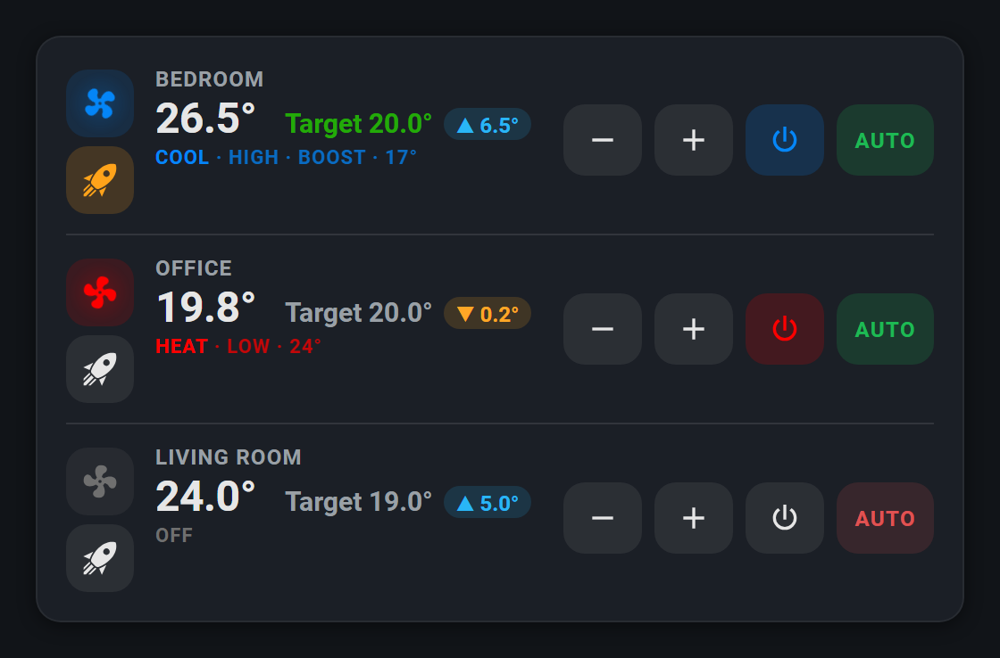
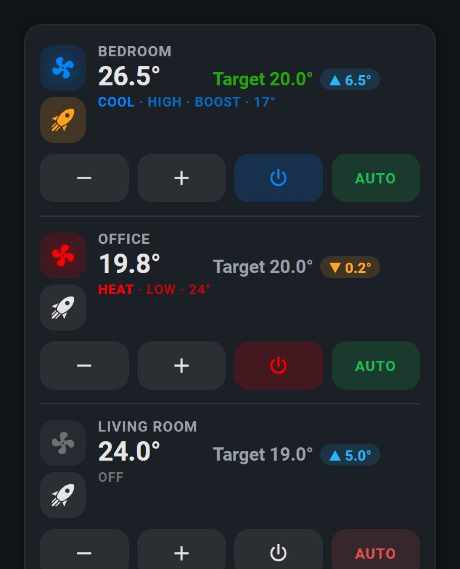
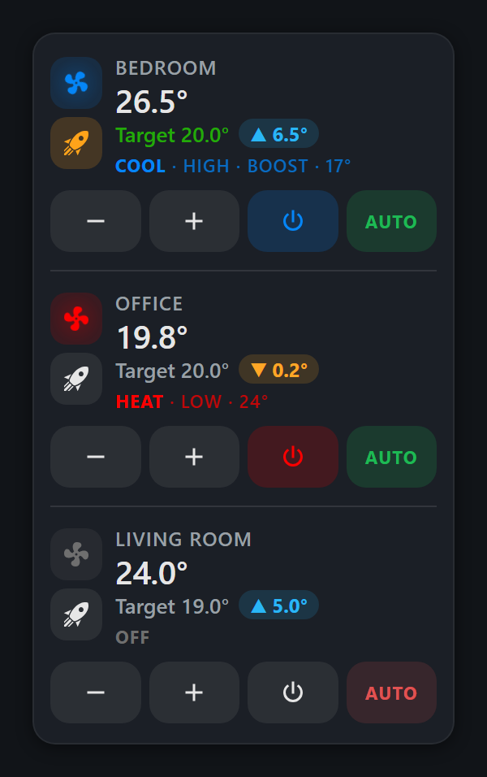

# HA AC Control

A compact custom [Home Assistant](https://www.home-assistant.io/) Lovelace card for
air-conditioning and heat-pump `climate` entities. Several rooms share one rounded
card — each row shows a fan that spins with the unit, the room temperature, its
target, how far apart they are, the current HVAC mode, and four touch-sized controls.



Everything is picked from dropdowns in a GUI editor, so no hand-written YAML is
required. One file, no build step, no external dependencies.

The same card at phone widths — the four controls keep one line, and boost stays
under the fan:

| 380px | 300px |
|---|---|
|  |  |

## Features

- **One card, many rooms.** Rooms are separated by a thin divider; the card height
  follows the number of rooms.
- **Difference badge** — `▲ 6.5°` when the room is warmer than the target, `▼ 0.2°`
  when it is colder, `at target` when it is there. Never renders `NaN` or `unknown`.
- **Spinning fan** in a rounded square, tinted by HVAC mode and gently glowing
  while the unit is producing heat or cold. It turns at the unit's reported
  `fan_mode` and faster on boost, and it **only spins while air is actually
  moving** — a unit that is off, idle, unavailable or merely powered but coasting
  shows a stationary fan.
- **Boost button directly beneath the fan** — an identical rounded square holding a
  rocket, which lights orange while that room is boosting. It is a real control,
  deliberately kept out of the main control row so those four buttons fit one line
  even on a phone. Units without a `boost` preset don't show it at all.
- **Four controls per room** on the right — minus, plus, power and AUTO.
- **Per-room isolation.** Every room's status, colours and button states come only
  from that room's own entities, so an unavailable unit never affects its neighbours.
- **Careful state handling.** Unavailable rooms are muted, controls that cannot act
  safely are disabled, and no placeholder temperature is ever invented.
- **Responsive.** Room text left, controls right; on phone widths the controls drop
  to their own line while boost stays under the fan, and on very narrow cards
  everything shrinks. Never scrolls horizontally.
- Accessible: real `<button>` elements, `aria-pressed`, per-room `aria-label`s,
  keyboard focus rings, and it honours `prefers-reduced-motion`.

## Installation

### HACS (recommended)

1. HACS → the ⋮ menu (top right) → **Custom repositories** → add
   `https://github.com/ilirdokle43/HA-AC-Control` with category **Dashboard**.
2. Find **AC Control Card** in HACS and install it — this adds the Lovelace resource
   automatically.
3. Edit a dashboard → **Add Card** → search for **"AC Control Card"**.

> Upgrading in place? Browsers cache Lovelace resources aggressively. If the card
> looks unchanged after an update, reload with `Ctrl+Shift+R`, or reset the frontend
> cache from the companion app.

### Manual

1. Copy [`ac-control-card.js`](ac-control-card.js) into your Home Assistant
   `config/www/` folder.
2. Add it as a Lovelace resource: **Settings → Dashboards → ⋮ → Resources → Add
   Resource**
   - URL: `/local/ac-control-card.js`
   - Resource type: **JavaScript module**
3. Edit a dashboard → **Add Card** → search for **"AC Control Card"**.

## Configuration

### Card options

| Option | Default | Description |
|---|---|---|
| `rooms` | — | List of rooms (see below). Omit it to configure a single room at the top level. |
| `temperature_step` | `0.5` | How much − and + move the target helper. |
| `show_name` | `true` | Show the room name line. |
| `show_boost` | `true` | Show the boost button on units that support the preset. |
| `tap_action` | `more-info` | Standard HA action config for taps on the card body. |

### Room options

| Option | Required | Description |
|---|---|---|
| `climate_entity` | Yes | The AC's `climate.*` entity |
| `room_temp_entity` | Yes | A `sensor.*` reporting room temperature |
| `target_temp_entity` | Yes | An `input_number.*` used as the destination/target temperature |
| `room_name` | No | Display name (defaults to the entity's friendly name) |
| `season_entity` | No | An `input_boolean.*` or `binary_sensor.*` — `on` = heat, `off` = cool |
| `automation_cool_entity` | No | Automation toggled by AUTO when cooling (defaults to `automation.<climate_object_id>_command`) |
| `automation_heat_entity` | No | Automation toggled by AUTO when heating (defaults to `automation.<climate_object_id>_command_winter`) |
| `icon` | No | Override the fan glyph for this room |

### Example — several rooms

```yaml
type: custom:ac-control-card
rooms:
  - room_name: Bedroom
    climate_entity: climate.demo_bedroom_ac
    room_temp_entity: sensor.demo_bedroom_temperature
    target_temp_entity: input_number.demo_bedroom_target
    season_entity: input_boolean.demo_heating_season
  - room_name: Office
    climate_entity: climate.demo_office_ac
    room_temp_entity: sensor.demo_office_temperature
    target_temp_entity: input_number.demo_office_target
  - room_name: Living Room
    climate_entity: climate.demo_living_room_ac
    room_temp_entity: sensor.demo_living_room_temperature
    target_temp_entity: input_number.demo_living_room_target
```

### Example — a single room

The flat form from v1 still works exactly as before:

```yaml
type: custom:ac-control-card
name: Studio
climate_entity: climate.demo_studio_ac
room_temp_entity: sensor.demo_studio_temperature
target_temp_entity: input_number.demo_studio_target
season_entity: input_boolean.demo_heating_season
```

## How the buttons behave

- **− / +** call `input_number.set_value` on `target_temp_entity`, moving by
  `temperature_step` and never past the helper's own `min` / `max`. Rapid taps
  accumulate rather than resending the same value.
- **Power** calls `homeassistant.toggle` on `climate_entity`, and takes the room's
  mode colour while the unit is on.
- **AUTO** calls `homeassistant.toggle` on the automation for the current season —
  green when enabled, red when not. With no `season_entity` the cool automation is
  used.
- **Boost**, under the fan on the left, calls `climate.set_preset_mode` with
  `boost` / `none`. Hidden on units whose `preset_modes` do not include `boost`.

Controls whose entity is missing or unavailable are disabled rather than hidden, so
the row keeps its shape.

## Theming

Colours come from your theme where possible, and can be overridden per-card with
`card_mod` or globally in a theme:

| Variable | Default | Used for |
|---|---|---|
| `--acc-cool` | `#0586f7` | Cool mode |
| `--acc-heat` | `#fc0000` | Heat mode |
| `--acc-dry` | `#26c6da` | Dry mode |
| `--acc-fan` | `#66bb6a` | Fan-only mode |
| `--acc-auto` | `#ab47bc` | Auto mode |
| `--acc-above` | `#29b6f6` | "Warmer than target" badge |
| `--acc-below` | `#ffa726` | "Colder than target" badge |
| `--acc-boost` | `#ffa31a` | Boost button when active |
| `--acc-auto-on` | `#1db954` | AUTO enabled |
| `--acc-auto-off` | `#e05252` | AUTO disabled |
| `--acc-target-cool` | `#23aa08` | Target temperature in the cooling season |
| `--acc-target-heat` | `#fc0000` | Target temperature in the heating season |
| `--ac-control-card-gap` | `0` | Margin below the card, for containers that add no spacing of their own, such as `vertical-stack` |

## Notes

- Built as a single dependency-free JavaScript file (vanilla custom element + shadow
  DOM) — no build step, no external libraries, no CDN.
- `automation_cool_entity` / `automation_heat_entity` follow the naming pattern used
  by the [Midea AC LAN](https://github.com/wuwentao/midea_ac_lan) integration's
  related entities if left unset — override them explicitly if your setup uses
  different entity ids.
- See [CHANGELOG.md](CHANGELOG.md) for what changed between versions.

## License

[MIT](LICENSE)
