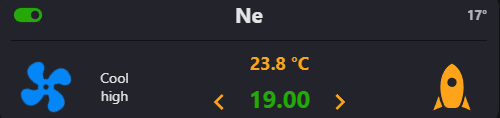

# HA AC Control

A compact custom [Home Assistant](https://www.home-assistant.io/) Lovelace card for
controlling a Midea (or similar `climate.*`) AC unit, with a GUI config editor so
entities are picked from dropdowns instead of hand-written YAML.



## Features

- Spinning fan icon — animation speed follows the AC's `fan_mode`, color switches
  blue (cool) / red (heat) based on a heat/cool selector entity (`input_boolean` or
  `binary_sensor`).
- Centered title with the AC's current on-unit setpoint shown top-right.
- Room temperature reading (1 decimal) and a separate destination/target
  temperature (from an `input_number`) with `‹ ›` steppers that adjust it by
  exactly 0.05 per tap, sized for touchscreen/tablet use.
- Boost preset toggle (large tap target).
- Top-left toggle for whichever automation matches the current season (cool vs.
  heat), auto-derived from the climate entity's name unless overridden.
- Responsive: a CSS container query shrinks the whole layout on narrow cards
  (phones/tablets) without affecting wider desktop dashboards.
- Tap the card for the climate entity's more-info dialog; tap the fan icon to
  toggle the AC on/off directly.

## Installation

1. Copy [`ac-control-card.js`](ac-control-card.js) into your Home Assistant
   `config/www/` folder.
2. Add it as a Lovelace resource: **Settings → Dashboards → ⋮ → Resources → Add
   Resource**
   - URL: `/local/ac-control-card.js`
   - Resource type: **JavaScript module**
3. Edit a dashboard → **Add Card** → search for **"AC Control Card"**. The GUI
   editor will prompt for the required entities.

## Configuration

| Field | Required | Description |
|---|---|---|
| `climate_entity` | Yes | The AC's `climate.*` entity |
| `room_temp_entity` | Yes | A `sensor.*` reporting room temperature |
| `target_temp_entity` | Yes | An `input_number.*` used as the destination/target temperature |
| `season_entity` | Yes | An `input_boolean.*` or `binary_sensor.*` — `on` = heat, `off` = cool |
| `name` | No | Display name in the title (defaults to the climate entity's friendly name) |
| `automation_cool_entity` | No | Automation toggled when cooling (defaults to `automation.<climate_object_id>_command`) |
| `automation_heat_entity` | No | Automation toggled when heating (defaults to `automation.<climate_object_id>_command_winter`) |

Example YAML:

```yaml
type: custom:ac-control-card
name: Ne
climate_entity: climate.your_ac
room_temp_entity: sensor.your_room_temperature
target_temp_entity: input_number.your_target_temperature
season_entity: input_boolean.dimer_manual
```

## Notes

- `automation_cool_entity` / `automation_heat_entity` follow the naming pattern
  used by the [Midea AC LAN](https://github.com/wuwentao/midea_ac_lan)
  integration's related entities (`switch.<id>_power`, etc.) if left unset —
  override them explicitly if your setup uses different entity IDs.
- Built as a single dependency-free JavaScript file (vanilla custom element +
  shadow DOM) — no build step, no external libraries.
